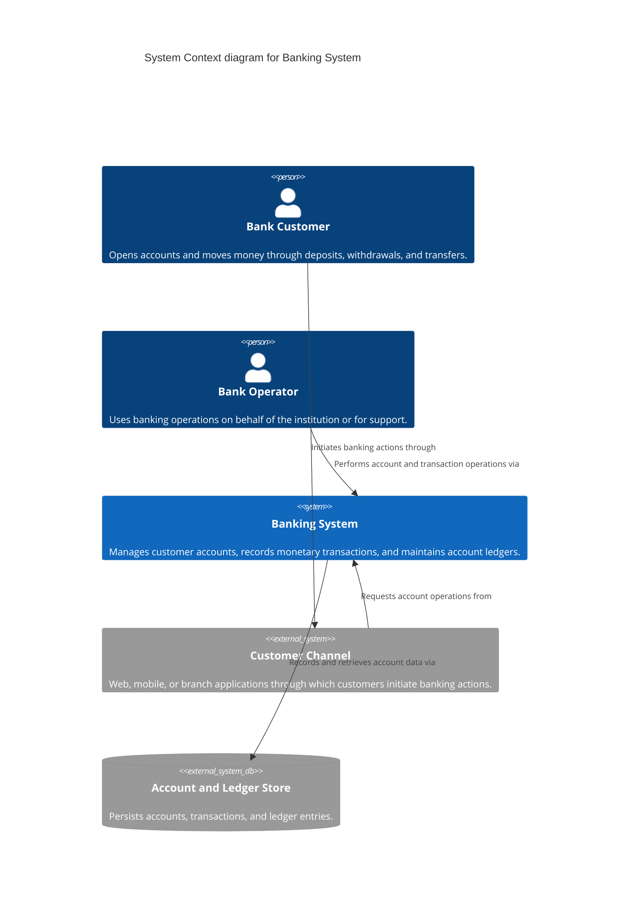
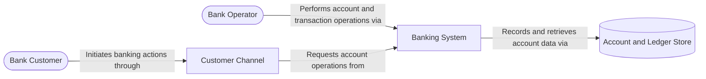
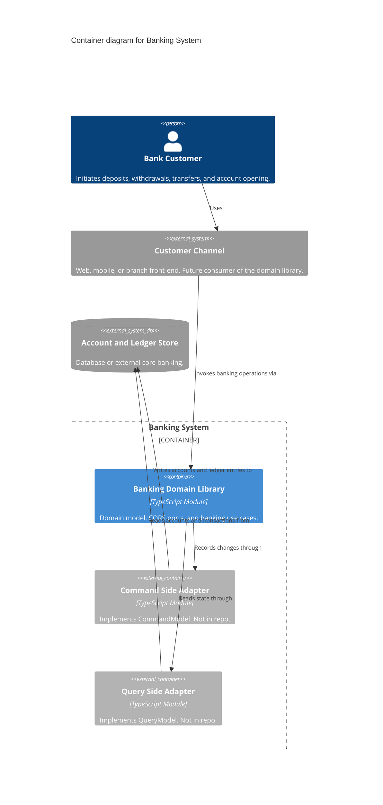
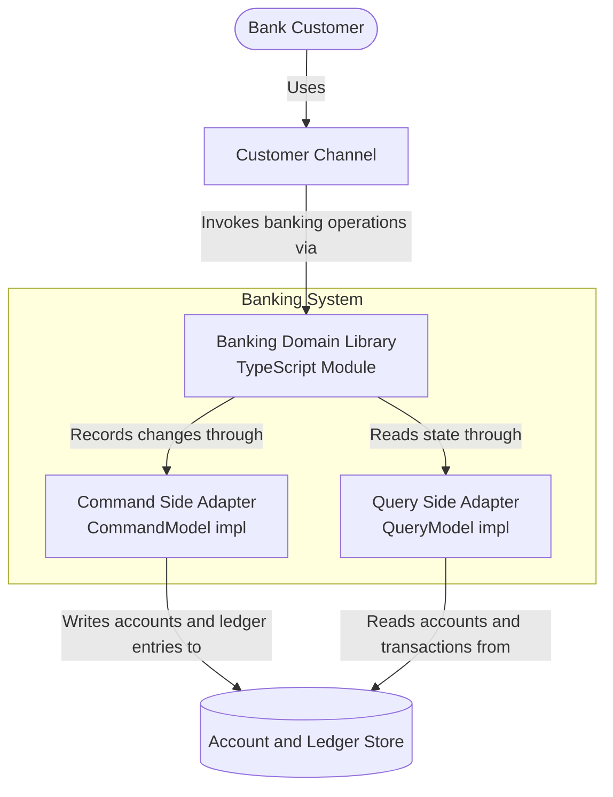
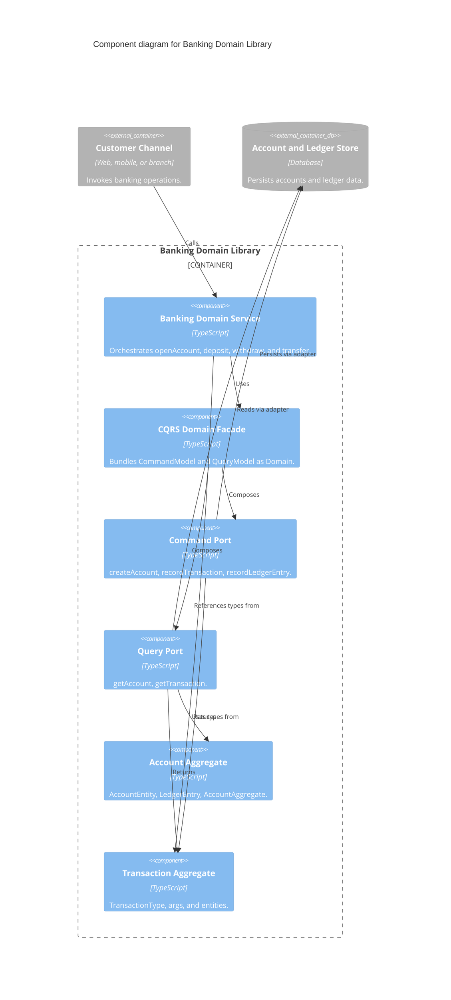
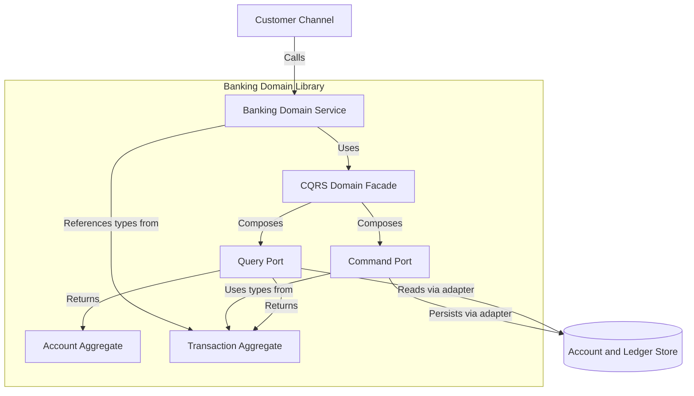
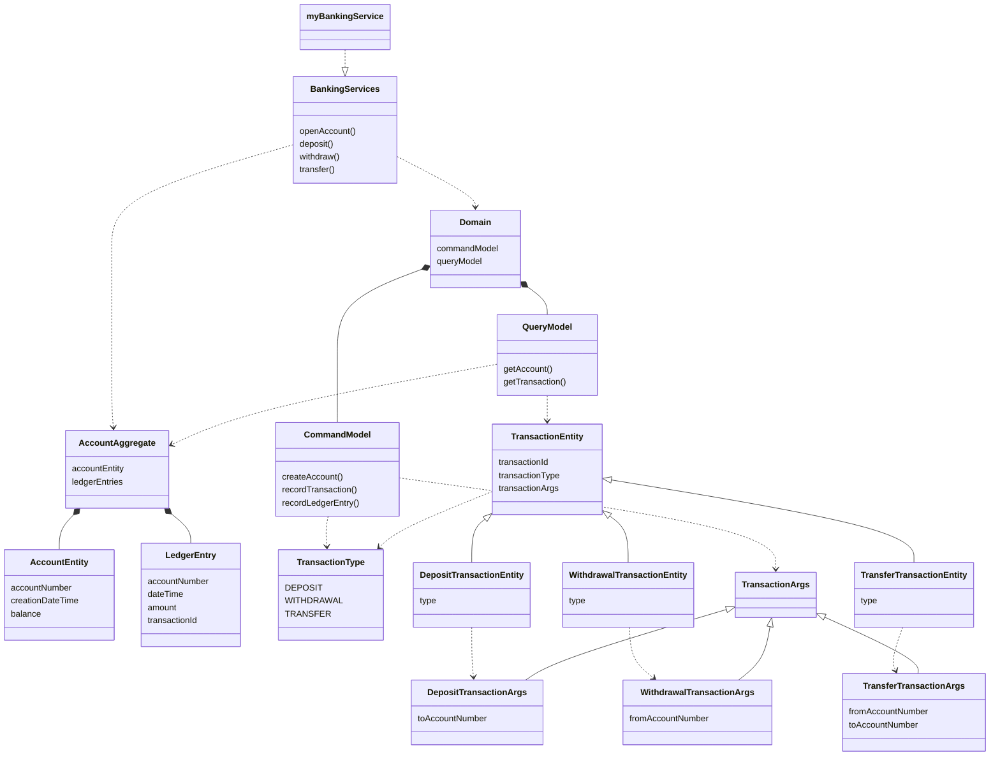

# Banking System C4 Diagrams

Open this file and use **Markdown Preview** (`Cmd+Shift+V`).

Cursor preview may not render `C4Context` diagrams. Use the **Preview-compatible** sections below, or paste `.mmd` files into [mermaid.live](https://mermaid.live).

---

## C1 - System Context

**Question:** What is this system and who interacts with it?

### C4 syntax (mermaid.live / GitHub)

### Preview-compatible

---

## C2 - Container

**Question:** What are the main building blocks and how do they communicate?

### C4 syntax (mermaid.live / GitHub)

### Preview-compatible

---

## C3 - Component

**Question:** How is the Banking Domain Library architected internally?

### C4 syntax (mermaid.live / GitHub)

### Preview-compatible

---

## C4 - Code

**Question:** What are the key types and how do they relate?

