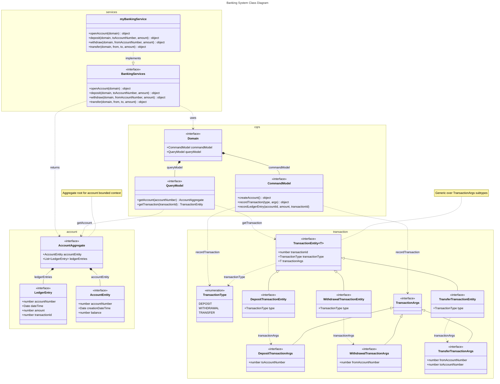

# Banking System Class Diagram

Static structure of types in `banking/` — interfaces, enum, and service implementation.

Open with **Markdown Preview** (`Cmd+Shift+V`) or paste [banking-system.mmd](./banking-system.mmd) into [mermaid.live](https://mermaid.live).

**Question:** What are the classes, attributes, operations, and relationships in the banking domain?

## Legend

| Stereotype | Meaning |
|-----------|---------|
| `<<interface>>` | TypeScript interface |
| `<<enumeration>>` | TypeScript enum |
| `<\|--` | Inheritance / extends |
| `*--` | Composition |
| `..>` | Dependency |
| `..\|>` | Realization / implements |

## Namespaces

| Namespace | Types |
|-----------|-------|
| `account` | LedgerEntry, AccountEntity, AccountAggregate |
| `transaction` | TransactionType, args, entities |
| `cqrs` | CommandModel, QueryModel, Domain |
| `services` | BankingServices, myBankingService |

