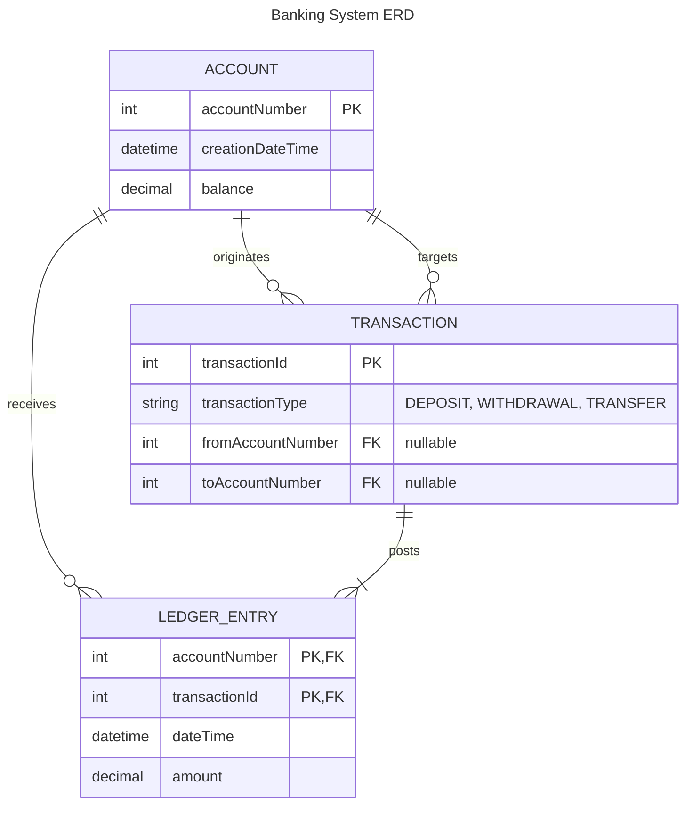

# Banking System ERD

Entity-relationship model for persisted data in the banking domain.

Open with **Markdown Preview** (`Cmd+Shift+V`) or paste [banking-system.mmd](./banking-system.mmd) into [mermaid.live](https://mermaid.live).

**Question:** What entities are stored, what are their attributes, and how do they relate?

Derived from `AccountEntity`, `LedgerEntry`, and `TransactionEntity` in `banking/`.

## Entities

| Entity | Description |
|--------|-------------|
| **ACCOUNT** | A customer account with balance and creation date |
| **TRANSACTION** | A recorded banking operation (deposit, withdrawal, transfer) |
| **LEDGER_ENTRY** | A credit or debit line on an account linked to a transaction |

## Relationships

| Relationship | Cardinality | Meaning |
|--------------|-------------|---------|
| ACCOUNT → LEDGER_ENTRY | one to many | An account has zero or more ledger entries |
| TRANSACTION → LEDGER_ENTRY | one to many | A transaction posts one or more ledger entries |
| ACCOUNT → TRANSACTION (originates) | one to many | Withdrawals and transfers reference a source account |
| ACCOUNT → TRANSACTION (targets) | one to many | Deposits and transfers reference a target account |

## Notes

- `fromAccountNumber` and `toAccountNumber` on **TRANSACTION** are nullable and depend on `transactionType`.
- A **TRANSFER** posts two **LEDGER_ENTRY** rows (debit on source, credit on target).
- **ACCOUNT.balance** is derived from ledger entries in a full implementation; it is stored on the account in the current domain model.

