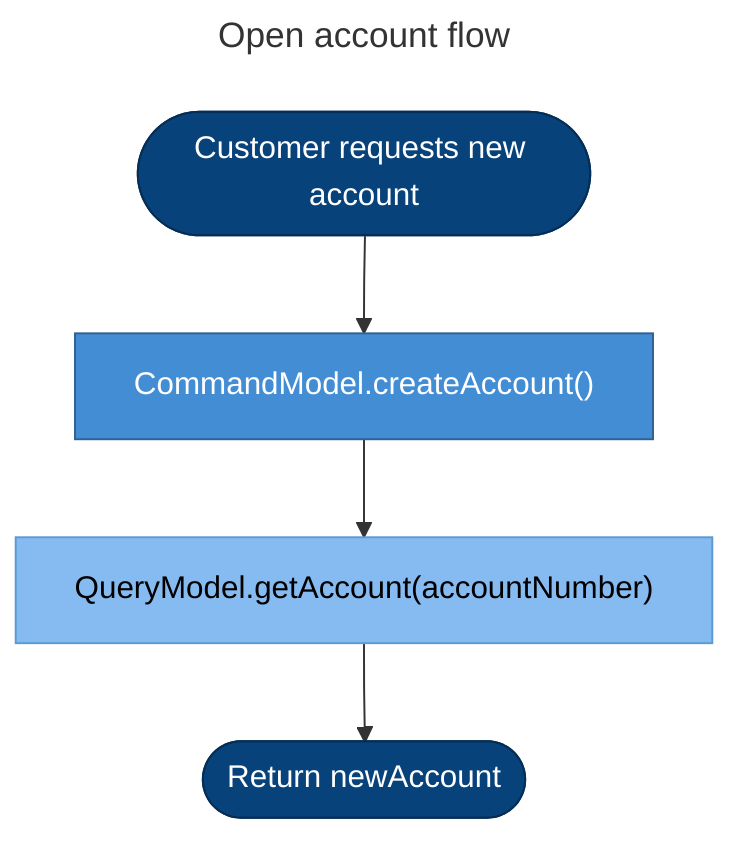
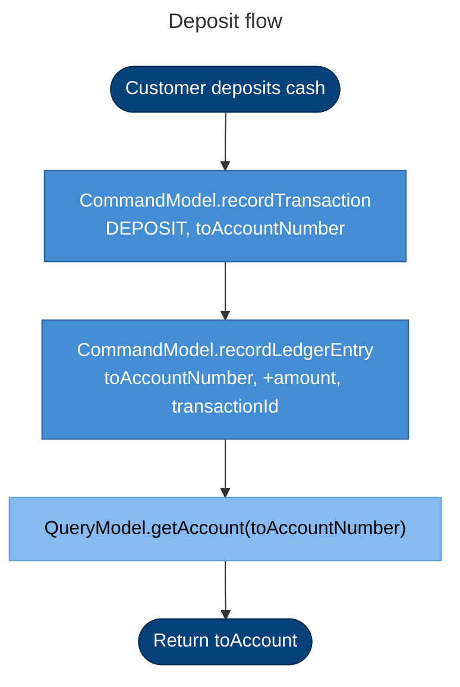
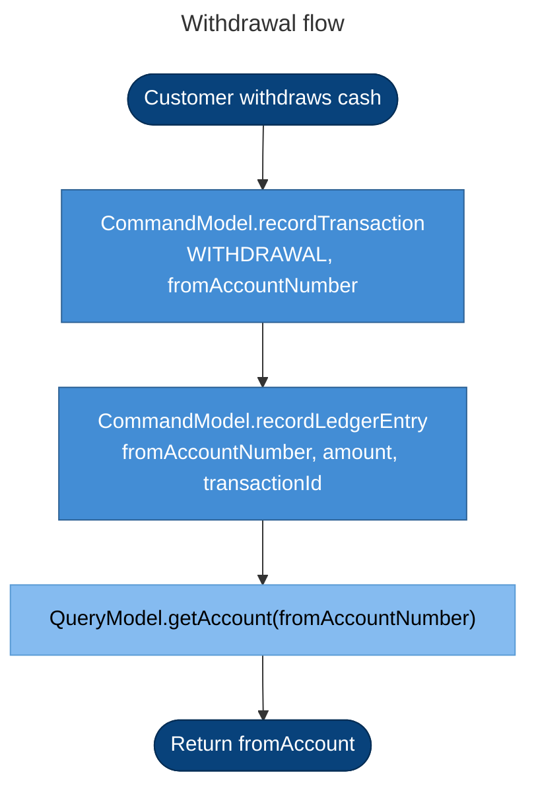
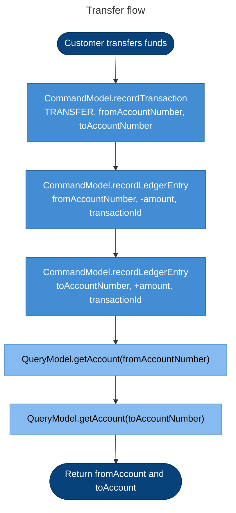

# Banking System Flows

Flowcharts for **how the banking system behaves** — each operation in `myBankingService`.

Open with **Markdown Preview** (`Cmd+Shift+V`) or paste `.mmd` files into [mermaid.live](https://mermaid.live).

C4 architecture diagrams live separately in [../c4/diagrams.md](../c4/diagrams.md).

## Flow index

| Flow | Question | File |
|------|----------|------|
| Open account | How is a new account opened? | [open-account.mmd](./open-account.mmd) |
| Deposit | How does a deposit work? | [deposit.mmd](./deposit.mmd) |
| Withdrawal | How does a withdrawal work? | [withdraw.mmd](./withdraw.mmd) |
| Transfer | How does a transfer work? | [transfer.mmd](./transfer.mmd) |

## Legend

| Color | Step type |
|-------|-----------|
| Dark blue (stadium) | Customer trigger / result |
| Blue | CommandModel (write side) |
| Light blue | QueryModel (read side) |

---

## Open account

**Question:** How is a new account opened?

---

## Deposit

**Question:** How does a deposit work?

---

## Withdrawal

**Question:** How does a withdrawal work?

---

## Transfer

**Question:** How does a transfer work?

