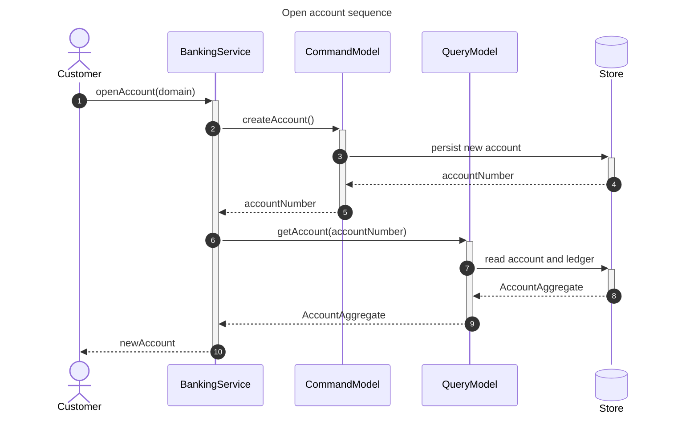
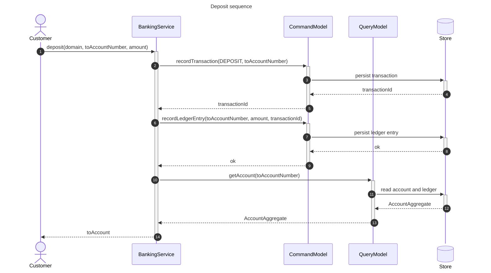
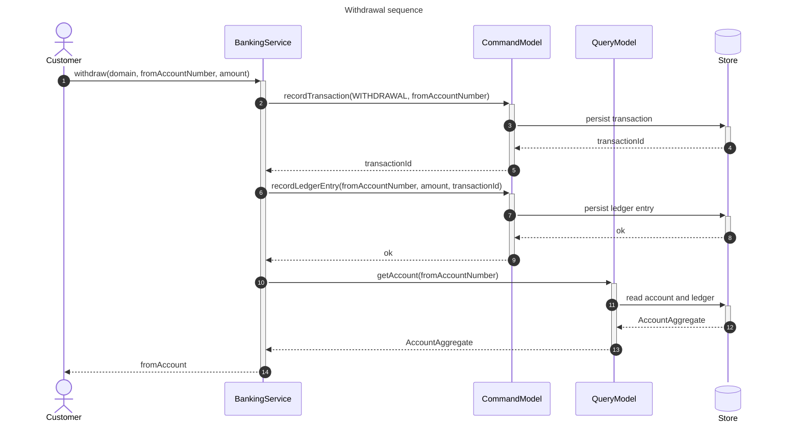
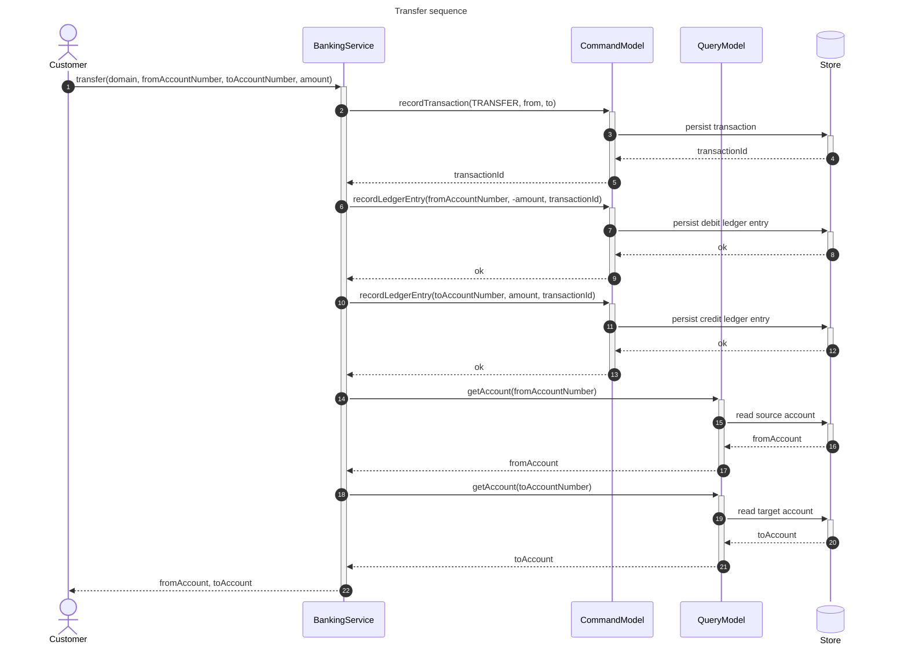

# Banking System Sequence Diagrams

Interaction diagrams for each operation in `myBankingService`.

Open with **Markdown Preview** (`Cmd+Shift+V`) or paste `.mmd` files into [mermaid.live](https://mermaid.live).

**Question:** In what order do participants interact for each banking operation?

## Participants

| Participant | Role |
|-------------|------|
| **Customer** | Initiates the operation |
| **BankingService** | `myBankingService` — orchestrates the use case |
| **CommandModel** | Write side — accounts, transactions, ledger entries |
| **QueryModel** | Read side — account aggregates |
| **Store** | Account and ledger persistence (not implemented in repo) |

## Diagram index

| Operation | File |
|-----------|------|
| Open account | [open-account.mmd](./open-account.mmd) |
| Deposit | [deposit.mmd](./deposit.mmd) |
| Withdrawal | [withdraw.mmd](./withdraw.mmd) |
| Transfer | [transfer.mmd](./transfer.mmd) |

---

## Open account

---

## Deposit

---

## Withdrawal

---

## Transfer

