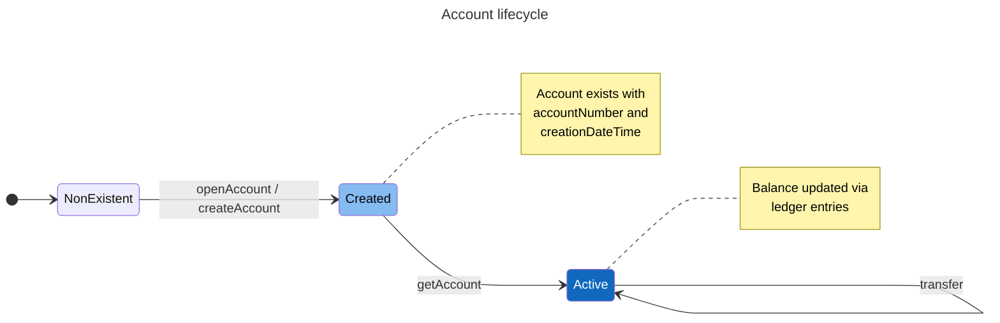
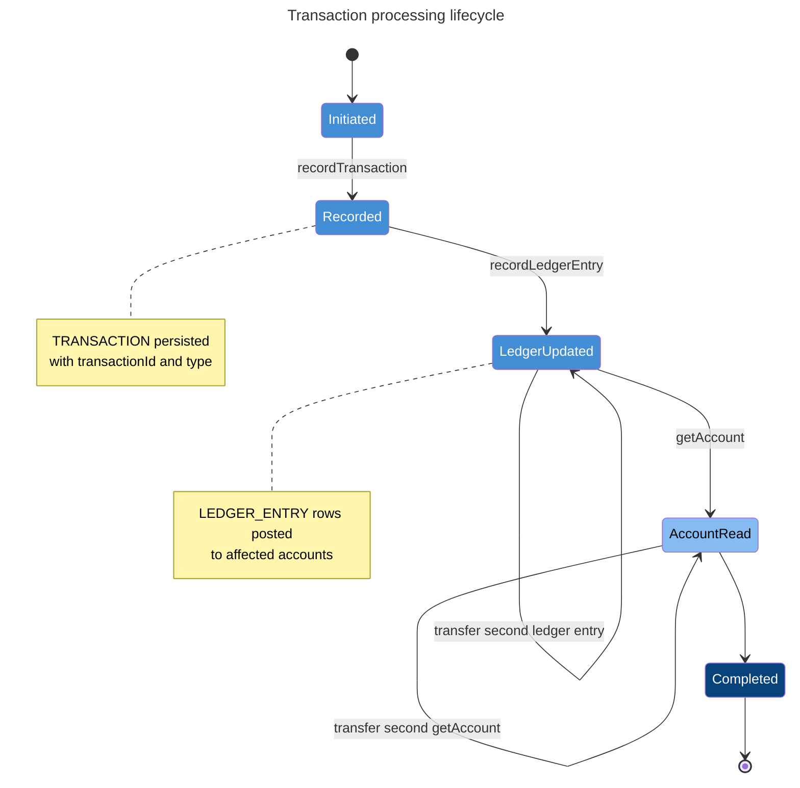
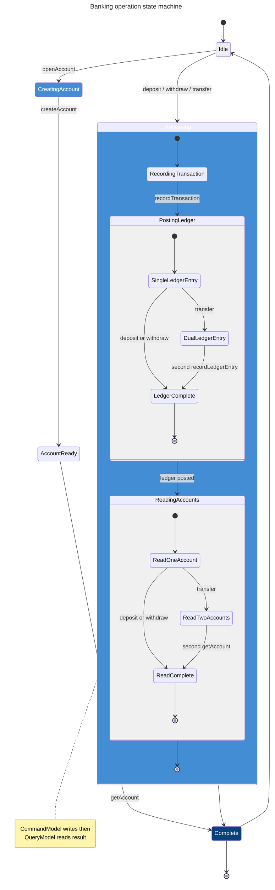
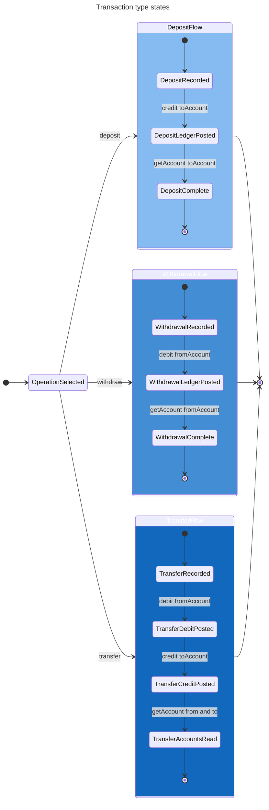

# Banking System State Diagrams

State machines describing behavior in the banking domain.

Open with **Markdown Preview** (`Cmd+Shift+V`) or paste `.mmd` files into [mermaid.live](https://mermaid.live).

**Question:** What states can the system be in, and what events cause transitions?

Derived from `myBankingService` and domain entities in `banking/`.

## Diagram index

| Diagram | Question | File |
|---------|----------|------|
| Account lifecycle | What states can an account be in? | [account-lifecycle.mmd](./account-lifecycle.mmd) |
| Transaction processing | What states does a transaction go through? | [transaction-processing.mmd](./transaction-processing.mmd) |
| Banking operation | How does the service move between idle and complete? | [banking-operation.mmd](./banking-operation.mmd) |
| Transaction type | How do deposit, withdrawal, and transfer differ? | [transaction-type.mmd](./transaction-type.mmd) |

---

## Account lifecycle

**Question:** What states can an account be in?

---

## Transaction processing lifecycle

**Question:** What states does a monetary operation pass through?

---

## Banking operation state machine

**Question:** How does the banking service move from idle to complete?

---

## Transaction type states

**Question:** How do deposit, withdrawal, and transfer paths differ?

